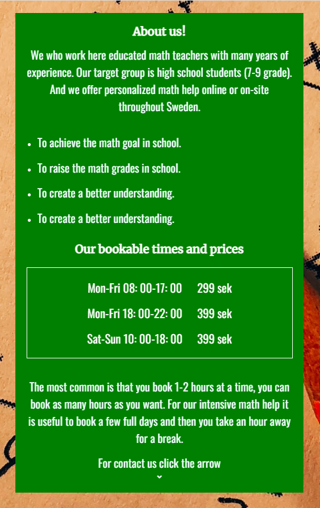
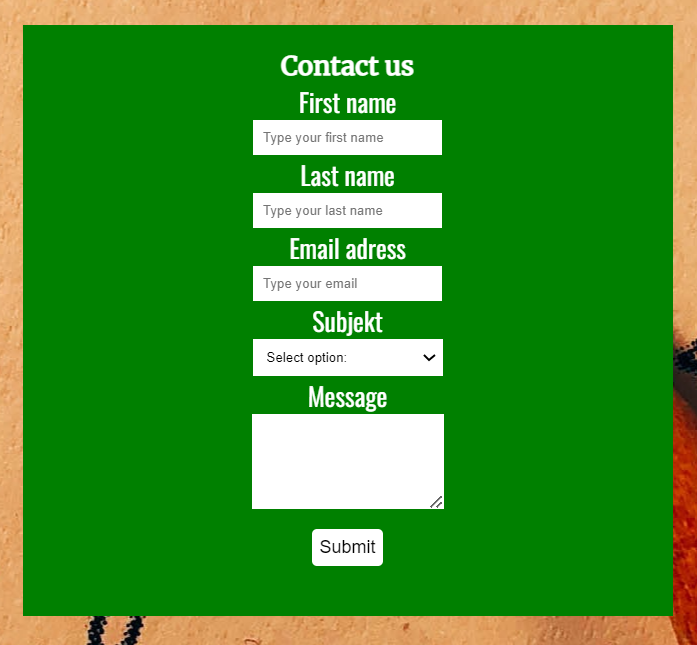

# Math help

The Matte help website is a landing page that presents and informs about "Matte help" services.

Math help services are for high school students, who need extra help or want to increase their grades and understanding of math.

## Features

- __Navigation__

  - The company name (logo) is located at the top left of the page and navigates to the home section.
  - The other navigation links are: Home, About and Contact. And they are located at the top right of the page. All links navigate to their section on the page.
  - The navigation is clear. This makes it easy for users to find what it is looking for.

  

- __Home section__

  - The home section welcomes visitors and gives a brief description of the company.
  - The home section also has an icon that navigates to "About us".

  

- __About us section__

  - In the about section, the user can read more details about the company.
  - In the section, the user gets a more detailed information about what the company has to offer.
  - In the section, the user also receives a price and time list.
  - The section also explains how the user should do to take part in the company's services.
  - The section also has an icon that navigates to the "Contact" section.

  

- __Contact us section__

  - In the contact section there is a contact form.
  - In the form, fill in your first name, last name, e-mail and select the subject and write your message.

  

- __footer__

  - The company name (logo) is located at the bottom left of the page and navigates to the home section.
  -  At the bottom left, there are icons that link to the company's social media.

  

