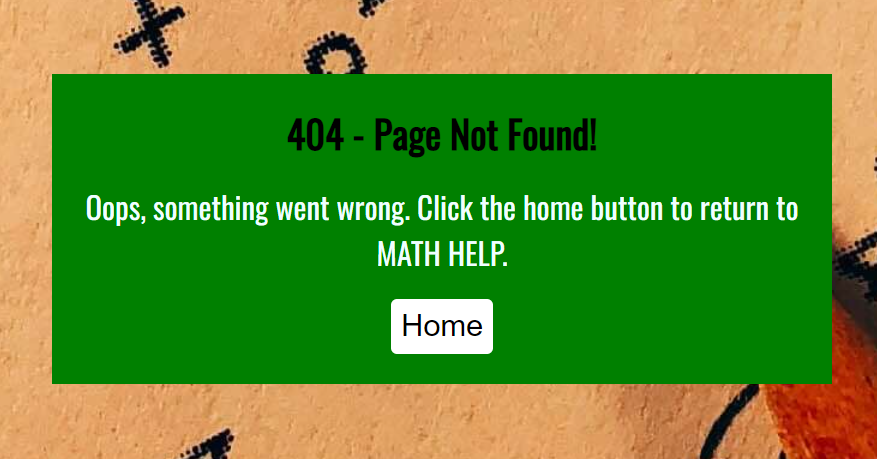
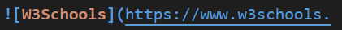
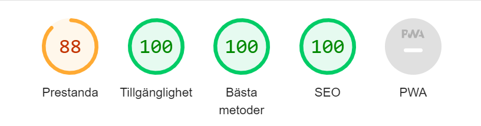
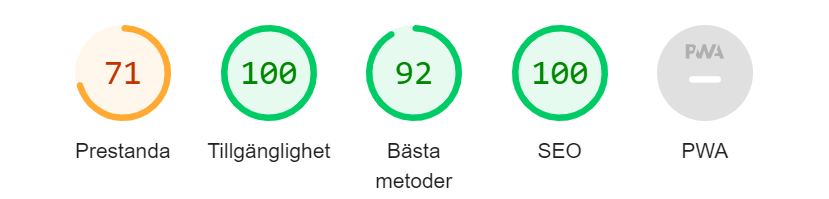

# Math Help

The Matte help website is a landing page that presents and informs about "Matte help" services.

Math help services are for high school students, who need extra help or want to increase their grades and understanding of math. 

## Features

- __Navigation__

  - The company name (logo) is located at the top left of the page and navigates to the home section.
  - The other navigation links are: Home, About and Contact. And they are located at the top right of the page. All links navigate to their section on the page.
  - This gives the user a quick overview of what the website contains. And facilitates the user's navigation on the page.
  - The navigation is clear and all links have a hovering effect.

  

- __Home Section__

  - The home section welcomes visitors and gives a brief description of the company and about their services.
  - The home section also has an icon whit a hovering effect that navigates to "About Us".

  

- __About Us Section__

  - In the section, the user can read more details about the company.
  - In the section, the user gets a more detailed information about what the company has to offer.
  - In the section, the user also receives a price and time list.
  - The section also explains how the user should do to take part in the company's services.
  - The section also has an icon whit a hovering effect that navigates to the "Contact" section.

  

- __Contact Us Section__

  - In the contact section there is a contact form.
  - In the contact form, the user needs to fill in their first name, last name, and e-mail, select a subject and write their message.
  - All fields except select are requierd so users do not miss anything important.
  - The user gives the company the information the company needs. This allows the company to provide the user with a well-tailored service.
  - The contact form facilitates communication between the user and the company. 

  

- __Footer__

  - The company name (logo) is located at the bottom left of the page and navigates to the home section. This facilitates navigation for the user. 
  -  At the bottom left, there are icons that link to the company's social media. This allows the user to learn more and intrigue with the company
    - All links open on a new page. It makes it easier if the user has filled in the contact form but not sent it.
    -  All links have a hovering effect.

  

## Error Page

- __404.html__

  - The 404 page appears if the web page does not work.
  -  Short, recognizable, and easy to understand.
  -  This can help the user find their way back and stay on the page.

  

## Testing

- __Tested The Website__

  - Tested so the page works in different browsers: Chrome, Firefox, and Edge.
  -  I have tested so the page looks good on all screen sizes using devtools in browsers and https://ui.dev/amiresponsive .
  - I have checked so the form says if you fail to fill in something.

  ## Bugs

- __Solved Bugs__

  - My page did not respond to the css code when I used port 8000. I instead ran npx browser-sync start -s -w --ui-port 40001. And it works.

  - __README.md__

  - My links to different pages in my README.md
 did not work.

 - I discovered that it was because I used the same code that I used for my images.

 

 - I removed ! and it solved the problem.

   ## Validator Testing

- __Html__

  - The html code was approved in the W3C validator.

- __Css__

  - The css code was approved in the W3C validator (jigsaw).

- __Page Quality__

  - I tested the website through ligthouse in dev tools and here is the result.

### Computer
  

### Mobile
  

  - __Unfixed Bugs__

  - None.

## Deployment

### The site was deployd to GitHub pages. The steps to deployd are as follows:

  - Log in to GitHub and click on the repository you want to deploy.
  - Select settings and click on pages to the left in the menu.
  - From the source section in the left dropdown-menue select branch main.
  - In the right dropdown-menu for folder select /(rot).
  - Click save and the page deploy after auto-refresh.

The live link can be found here - [MATH HELP](https://assofiejakobsson.github.io/Projekt-1-Code-Institute/)

## Credits

### Content
 
 - __In my header and footer I have followed the Code Institute's walkthrough of the project "Love Running".__

 - __I have used [Code-Institute-Solutions/readme-template](https://github.com/Code-Institute-Solutions/readme-template/blob/master/README.md)  for my Read.md file.__

  - __The select option menu in my contact form did I take from [W3Schools](https://www.w3schools.com/howto/howto_custom_select.asp) .__

   - __The icons in my Home section, About Us section and in the footer did I take from [Font Awsome](https://fontawesome.com/) .__

   ### Media
 
 - __The image of the home section is taken from [Pexels](https://www.pexels.com/sv-se/).__

- __The backgrond image of the body is taken from [Unsplash](https://unsplash.com/).__

- __The favicon is made and taken from [favicon.io](https://favicon.io/favicon-converter/).__

   

  

